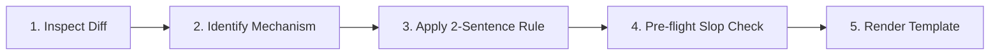

# Anti-Slop PR Description Protocol

This skill enforces high-signal, factual Pull Request descriptions. It eliminates conversational AI filler, architectural hyperbole, and poetic metaphors, grounding every explanation directly in the technical diff.

---

## The 4-Step Execution Protocol

When asked to generate or review a PR description, execute these 4 steps in order:



### Step 1: Inspect the Raw Diff
- Focus strictly on files modified, functions touched, parameters added, or queries altered.
- Disregard narrative summaries from chat history; ground explanations only in code facts.

### Step 2: Identify the Core Technical Mechanism
- State the root cause (e.g., race condition, off-by-one index, missing null check, unindexed column).
- State the programmatic fix (e.g., added mutex lock, added regex validation, created composite DB index).

### Step 3: Apply the Two-Sentence Rule
Draft the `## Summary` section using **maximum 2 plain sentences**:
- **Sentence 1 (What):** What was changed technically.
- **Sentence 2 (Why):** Why it was needed / what problem was solved.

### Step 4: Pre-Flight Slop Self-Check
Before returning the output, scan your draft against the **Blacklist Table** below. If any term appears, replace it with its plain engineering equivalent:

| Banned AI Term | Empirical Lift | Plain Engineering Replacement |
| :--- | :--- | :--- |
| `load-bearing` | **123×** | `critical`, `required`, `core` |
| `quietly` | **95×** | `defaults to`, `omits without throwing` |
| `delve` | **88×** | `inspects`, `traverses`, `parses` |
| `seam` | **84×** | `interface`, `module boundary` |
| `genuine` | **71×** | `valid`, `verified` |
| `robust` | **66×** | `error-handled`, `tested` |
| `latent` | **62×** | `hidden bug`, `unhandled condition` |
| `survived` | **58×** | `persisted`, `remained` |
| `seamless` | **59×** | `direct`, `automated` |
| `orchestrate` | **45×** | `coordinates`, `calls`, `runs` |

---

## Standard Output Template

Format all PR descriptions strictly using this markdown layout:

```markdown
## Summary
[Sentence 1: What changed technically]. [Sentence 2: Why it was needed].

## Changes
- `<file_path>`: [Exact technical modification]
- `<file_path>`: [Exact technical modification]

## Verification
- [Automated command or manual verification step]
```

### Edge-Case Handling:
- **Breaking Changes:** If the change breaks backwards compatibility, add a `## Breaking Changes` section with exact migration instructions. Do not use dramatic words like *"tectonic shift"*.
- **Database Migrations:** State the exact table, column names, and index types added/dropped.
- **Dependency Updates:** State the exact package name and version range diff (e.g. `Upgrade express from 4.18.0 to 4.21.0`).

---

## Extended References
- Comprehensive Banned Vocabulary: [references/banned-vocabulary.md](./references/banned-vocabulary.md)
- Paired Diff Translations: [examples/paired-diffs.md](./examples/paired-diffs.md)
