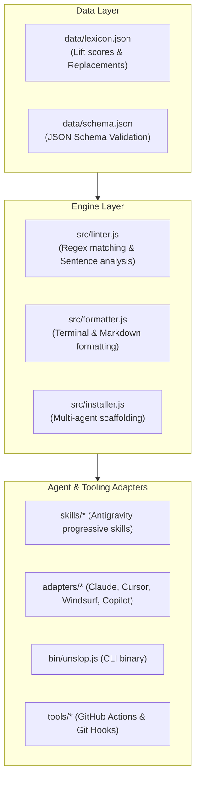

# Architecture Specification: Anti-Slop Toolkit

This document outlines the technical design, data lifecycle, and multi-agent integration standard of `@vernsg/anti-slop`.

---

## 1. Design Objectives

1. **Zero External Dependencies:** The core engine (`linter.js`, `installer.js`, `formatter.js`) runs purely on standard Node.js without heavy AST or native binaries.
2. **Progressive Disclosure Compatibility:** Integrates seamlessly into modern AI agent standards (Antigravity Skills, Cursor rules, Claude Code, Copilot instructions).
3. **Empirical Grounding:** Every rule and penalty corresponds to verifiable frequency lift from corpus clustering studies.

---

## 2. Component Diagram

---

## 3. Linter Scoring Algorithm

The `Slop Score` ($S$) is calculated as:

$$S = \min\left(100, \sum_{i \in \text{matches}} P_i + \text{Penalty}_{\text{sentences}}\right)$$

Where:
- $P_i$ is the penalty weight of category $i$ (`structural_metaphor`: 25, `dramatic_verbs`: 15, `ai_filler_adjectives`: 12, `empty_meta_framing`: 20).
- $\text{Penalty}_{\text{sentences}} = \max(0, N_{\text{sentences}} - 2) \times 5$ when sentence limit enforcement is enabled.
- A score of $0$ earns Grade **A+ (Clean)**. Scores $>50$ fail standard PR gates.

---

## 4. Multi-Agent Ecosystem Support

- **Antigravity**: Progressive skill loading via `skills/anti-slop-pr/SKILL.md` and bundle manifest `plugins/anti-slop/plugin.json`.
- **Claude Code**: Direct global/workspace context via `CLAUDE.md`.
- **Cursor IDE**: Editor-level workspace prompt via `.cursorrules`.
- **Windsurf Cascade**: Workspace rule specification via `.windsurfrules`.
- **GitHub Copilot**: Repository instruction context via `.github/copilot-instructions.md`.
