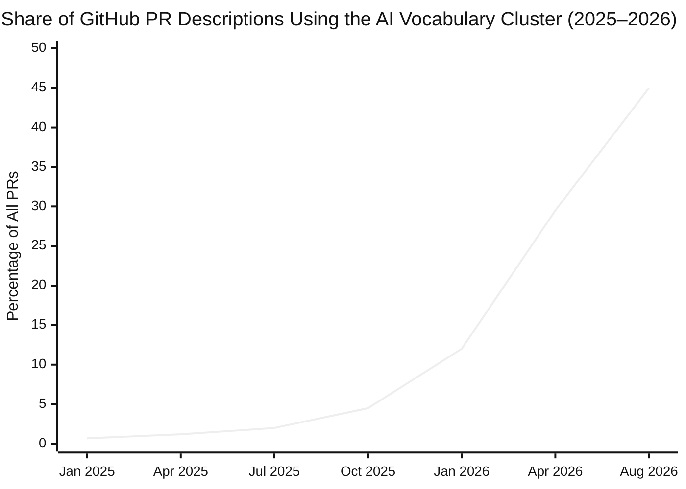
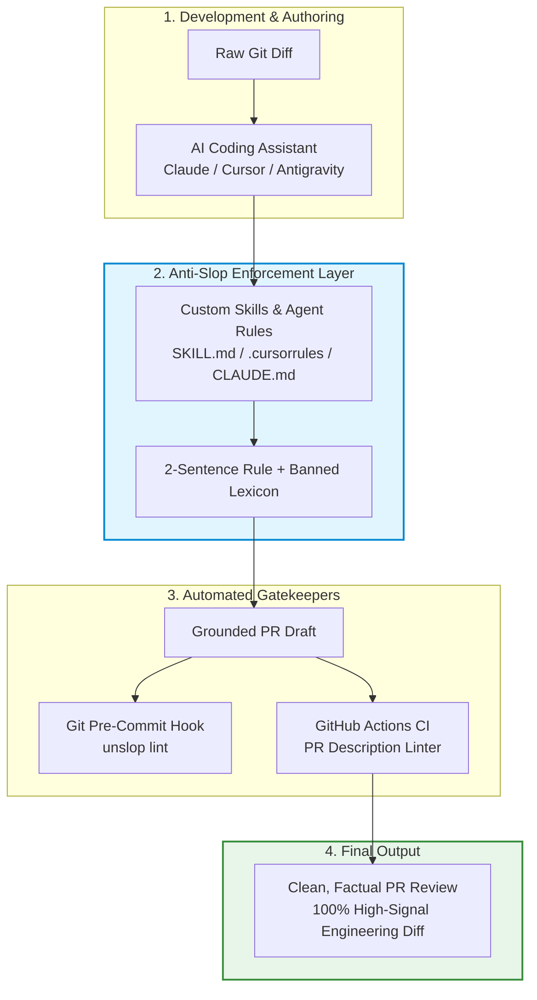

<div align="center">

# 🛡️ Anti-Slop (`@vernsg/anti-slop`)

**Stop AI slop from polluting your Git PR descriptions, commit messages, and reviews.**  
*Grounded in empirical cluster analysis of 461,000+ GitHub Pull Requests (Louis Abraham, 2026).*

[](./LICENSE)
[]()
[]()
[]()

<br/>

```text
❌ "This PR quietly refactors a load-bearing seam across the auth layer..."
⬇
✅ "Fixes token refresh race condition by adding a mutex lock in auth.go."
```

</div>

---

## 📊 The Empirical Data: Why This Exists

In August 2026, AI researcher **Louis Abraham** published a data study titled [*The Load-Bearing Vocabulary of Claude*](https://louisabraham.github.io/load-bearing/). 

By scraping **461,121 GitHub Pull Requests** (>5,000,000 words) from human-attributed accounts and clustering them via **KL-divergence $k$-means** ($k=10$), the research revealed an unprecedented stylistic shift:



### 🚨 The Problem: Erosion of the "Effort Signal"
1. **45% of PRs share the exact same vocabulary:** Phrases like *"load-bearing"* spiked by **+12,304%** ($123\times$ increase).
2. **Reviewers stop reading descriptions:** When every 5-line bugfix is described as *"safeguarding an architectural seam"*, reviewers lose trust in text summaries and rely solely on raw diffs.
3. **Loss of mechanism:** Specific failure modes (deadlocks, memory leaks, null pointers) are masked by polite, grandiose AI abstractions (*"robust"*, *"seamless"*, *"quietly resolves"*).

---

## 🏗️ Architecture & How It Works

`@vernsg/anti-slop` provides a multi-layer filter that stops AI slop at the editor, the assistant prompt, the git hook, and the CI gate:



---

## ⚡ Quick Start (1-Minute Setup)

Scaffold anti-slop rules into your repository with one command:

```bash
# Install rules for all supported agents + PR template
npx @vernsg/anti-slop install --agent all
```

Or install for specific tools:
```bash
# Specific agents: antigravity, cursor, claude, windsurf, copilot, gemini
npx @vernsg/anti-slop install --agent cursor,claude,antigravity
```

### Check any text or PR description via CLI:
```bash
npx @vernsg/anti-slop lint "This PR quietly protects the load-bearing auth seam"
```

Output:
```text
🔍 Anti-Slop PR Analysis Report
──────────────────────────────────────────────────────
✖ FAILED: AI Slop detected! Slop Score: 65/100 [Grade: F (Severe AI Slop)]
Found 3 offending terms/phrases:

  1. "quietly" (Line 1:9)
     Category   : dramatic_verbs (Severity: medium, Lift: 95.4x)
     Suggestion : defaults / omits without throwing

  2. "load-bearing" (Line 1:31)
     Category   : structural_metaphor (Severity: high, Lift: 123.04x)
     Suggestion : critical / required / core
     ❌ Bad     : "protects a load-bearing seam across the auth layer"
     ✅ Better  : "prevents null pointer exception in auth handler"

  3. "seam" (Line 1:49)
     Category   : structural_metaphor (Severity: high, Lift: 84.12x)
     Suggestion : interface / boundary / module
```

---

## 🔤 The Slop Blacklist (Top Research Shibboleths)

| Banned AI Term | Empirical Lift | Category | Plain Senior Engineer Replacement |
| :--- | :--- | :--- | :--- |
| **`load-bearing`** | **123.04×** | Structural Metaphor | `critical`, `required`, `core` |
| **`quietly`** | **95.40×** | Dramatic Verb | `defaults`, `omits without throwing` |
| **`delve`** | **88.70×** | Dramatic Verb | `inspect`, `traverse`, `parse` |
| **`seam`** | **84.12×** | Structural Metaphor | `interface`, `module boundary` |
| **`tapestry`** | **82.00×** | Empty Metaphor | `architecture`, `log suite` |
| **`genuine`** | **71.30×** | Filler Adjective | `valid`, `verified` |
| **`robust`** | **66.80×** | Filler Adjective | `tested`, `handles retries` |
| **`latent`** | **62.50×** | Structural Metaphor | `hidden`, `unhandled bug` |
| **`seamless`** | **59.40×** | Filler Adjective | `automated`, `direct` |
| **`survived`** | **58.20×** | Structural Metaphor | `persisted`, `remained` |
| **`safeguard`** | **52.30×** | Dramatic Verb | `validate`, `guard against` |
| **`plainly`** | **51.20×** | Filler Adverb | `explicitly`, `returns 400` |

---

## 📐 The Two-Sentence Rule

Every PR description summary generated with this toolkit follows a strict two-sentence protocol:

```markdown
## Summary
[Sentence 1: What changed technically]. [Sentence 2: Why it was needed].

## Changes
- `<file_path>`: [Exact technical change]
- `<file_path>`: [Exact technical change]

## Verification
- [Command executed / test passed]
```

### Side-by-Side Comparison

| Scenario | ❌ AI Slop Output | ✅ Anti-Slop (Senior Engineer) Output |
| :--- | :--- | :--- |
| **Concurrency Fix** | *"This PR quietly resolves a latent race condition by protecting the load-bearing auth seam to ensure genuine sessions survived."* | **"Adds a mutex lock to `RefreshToken` to prevent race conditions during simultaneous token refreshes. Verified with `go test -race`."** |
| **Input Validation** | *"We delve into user onboarding and orchestrate a robust validation layer to safeguard against invalid email structures."* | **"Returns HTTP 400 when registration email fails regex validation. Verified with user route unit tests."** |
| **DB Migration** | *"Executes a pivotal adjustment to streamline the order retrieval tapestry and safeguard against latency spikes."* | **"Adds composite index on `(user_id, created_at)` to `orders` table to speed up user history queries."** |

---

## 🤖 Supported Agent Platforms

| Platform | Configuration File | Installation Method |
| :--- | :--- | :--- |
| **Antigravity** | `.agents/skills/anti-slop-pr/SKILL.md` | `npx @vernsg/anti-slop install --agent antigravity` |
| **Claude Code** | `CLAUDE.md` | `npx @vernsg/anti-slop install --agent claude` |
| **Cursor IDE** | `.cursorrules` | `npx @vernsg/anti-slop install --agent cursor` |
| **Windsurf** | `.windsurfrules` | `npx @vernsg/anti-slop install --agent windsurf` |
| **Gemini CLI / IDE**| `GEMINI.md` | `npx @vernsg/anti-slop install --agent gemini` |
| **GitHub Copilot** | `.github/copilot-instructions.md` | `npx @vernsg/anti-slop install --agent copilot` |

---

## ⚙️ CI/CD & Git Hook Integration

### 1. GitHub Action (`.github/workflows/anti-slop.yml`)
```yaml
name: Anti-Slop PR Linter

on:
  pull_request:
    types: [opened, edited, synchronize]

jobs:
  lint-pr:
    runs-on: ubuntu-latest
    steps:
      - uses: actions/checkout@v4
      - name: Check PR Description
        run: |
          npx @vernsg/anti-slop lint "${{ github.event.pull_request.body }}"
```

### 2. Git Pre-Commit Hook
```bash
cp packages/anti-slop/tools/git-hook/prepare-commit-msg .git/hooks/prepare-commit-msg
chmod +x .git/hooks/prepare-commit-msg
```

---

## 📂 Repository Structure

```text
anti-slop/
├── data/
│   ├── lexicon.json                   # Empirical database of AI cliches with lift scores
│   └── schema.json                    # Schema for contributions
├── skills/
│   ├── anti-slop-pr/                  # Antigravity 2-Sentence PR skill
│   ├── anti-slop-commit/              # Conventional commit skill
│   └── anti-slop-review/              # Factual code review skill
├── plugins/
│   └── anti-slop/plugin.json          # Antigravity plugin manifest
├── adapters/                          # Drop-in rules for Cursor, Claude, Windsurf, Copilot
├── templates/                         # Standardized PR & commit templates
├── src/                               # Linter engine, installer, and formatter
├── tools/                             # Git hooks and GitHub Actions
└── test/                              # Automated test suites
```

---

## 🤝 Contributing & Research Reference

- Research: [Louis Abraham - The load-bearing vocabulary of Claude](https://louisabraham.github.io/load-bearing/)
- Guidelines: See [CONTRIBUTING.md](./CONTRIBUTING.md) to submit new terms or agent adapters.
- License: [MIT](./LICENSE)
