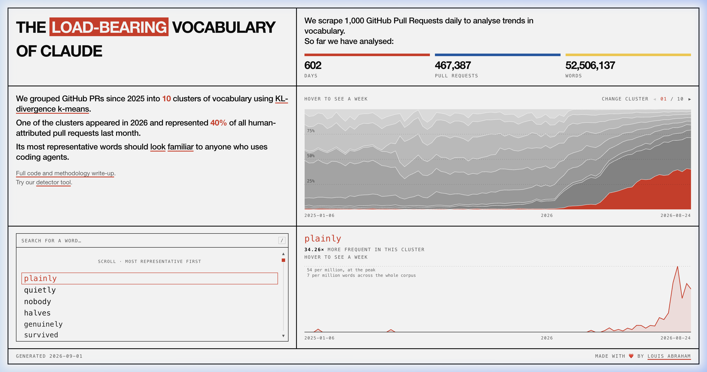

# anti-slop

Tooling and agent guidelines to eliminate LLM buzzwords from pull request descriptions and git commit messages.



According to research by [Louis Abraham](https://louisabraham.github.io/load-bearing/) analyzing 461,000+ GitHub PRs, 45% of human-attributed pull requests in 2026 share the exact same LLM vocabulary cluster. Words like "load-bearing" (+123x frequency spike), "seam", "quietly", "latent", and "genuine" increasingly replace concrete technical explanations with vague architectural metaphors.

`anti-slop` provides multi-agent configuration rules, PR templates, and a CLI linter to enforce plain, diff-grounded descriptions.

## Quick Start

Scaffold rules into your project for Antigravity, Claude Code, Cursor, Windsurf, Copilot, or Gemini:

```bash
npx @vernsg/anti-slop install --agent all
```

Or target specific tools:

```bash
npx @vernsg/anti-slop install --agent cursor,claude
```

## CLI Linter

Check a PR description or commit message:

```bash
npx @vernsg/anti-slop lint "This PR quietly refactors the load-bearing auth seam"
```

## The Two-Sentence Rule

Summarize pull requests in two plain sentences:
1. **What changed:** The concrete technical mechanism or modification.
2. **Why:** The specific problem solved or capability enabled.

| Type | Before (AI generated) | After (Grounded) |
| --- | --- | --- |
| Bugfix | Quietly resolves a latent race condition by protecting the load-bearing auth seam. | Adds mutex lock to `RefreshToken` to prevent concurrent token refresh race conditions. |
| Validation | Delves into user onboarding and orchestrates a robust validation layer. | Returns HTTP 400 when registration email fails regex validation. |
| Migration | Executes a pivotal adjustment to streamline the order retrieval tapestry. | Adds composite index on `(user_id, created_at)` to `orders` table. |

## Supported Agents

| Agent | Config Target | Install Command |
| --- | --- | --- |
| Antigravity | `.agents/skills/anti-slop-pr/SKILL.md` | `npx @vernsg/anti-slop install --agent antigravity` |
| Claude Code | `CLAUDE.md` | `npx @vernsg/anti-slop install --agent claude` |
| Cursor | `.cursorrules` | `npx @vernsg/anti-slop install --agent cursor` |
| Windsurf | `.windsurfrules` | `npx @vernsg/anti-slop install --agent windsurf` |
| Gemini | `GEMINI.md` | `npx @vernsg/anti-slop install --agent gemini` |
| Copilot | `.github/copilot-instructions.md` | `npx @vernsg/anti-slop install --agent copilot` |

## GitHub Action

```yaml
name: anti-slop
on: [pull_request]
jobs:
  lint:
    runs-on: ubuntu-latest
    steps:
      - uses: actions/checkout@v4
      - run: npx @vernsg/anti-slop lint "${{ github.event.pull_request.body }}"
```

## License

MIT
